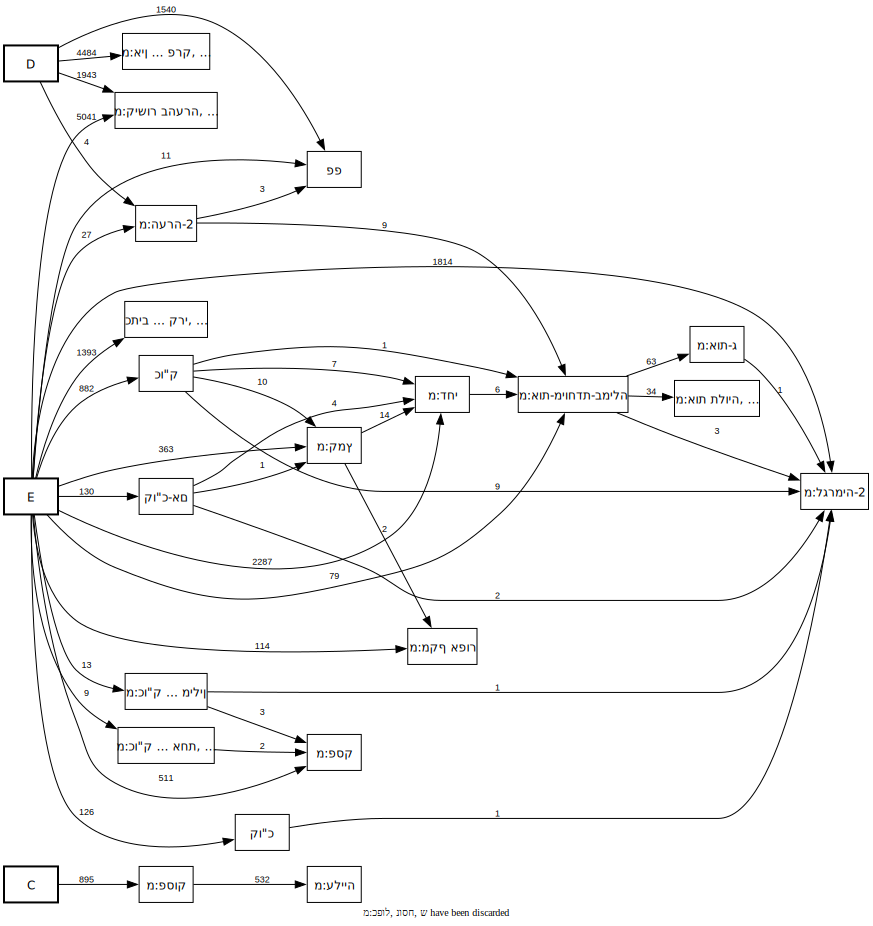
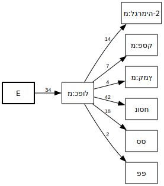
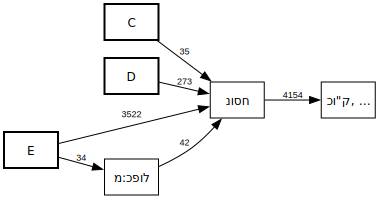

# Plus template call graphs

These call graphs show the **grammar of template nesting** in the
MAM-parsed plus format: which templates can appear inside which other
templates, and how often each combination occurs in the corpus.

Each node is a template (or a spreadsheet column: **C**, **D**, **E**).
An edge from A to B labelled *n* means "template A contains template B
as a parameter value in *n* corpus occurrences." Bold boxes represent
the top-level columns; regular boxes represent templates.

Some nodes are **collapsed groups**: when several templates have
identical predecessor and successor sets they are merged into a single
node. Hover over a collapsed node (indicated by ", ..." in its label)
to see the full list of grouped templates.

> **Note:** The templates **מ:כפול**, **נוסח**, and **ש** are discarded
> from the full call graph (including them
> would obscure the rest of the structure). The focused call graphs
> below restore them for the specific templates they highlight.

## Full call graph

Shows all template-nesting relationships in the plus format
(with מ:כפול, נוסח, and ש discarded, and מ:הערה deeply discarded):

## Focused call graph: מ:כפול (kaful)

Shows every call chain that passes through the **מ:כפול** (dual cantillation)
template:

## Focused call graph: נוסח (nusach)

Shows every call chain that passes through the **נוסח** (textual-variant)
template. Note that נוסח is always called either directly from a
top-level column (C, D, or E) or one level down, under מ:כפול:

